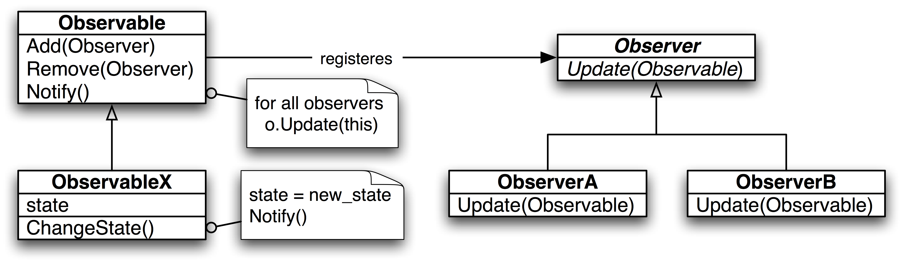

  
  
  

 
 

 

### ⭐ Que son los patrones de diseño?

Los patrones de diseño de programación son soluciones generales y reutilizables para problemas comunes que surgen durante el diseño y la implementación de software. Estos patrones representan las mejores prácticas desarrolladas y evolucionadas a lo largo del tiempo por programadores experimentados. Los patrones de diseño proporcionan un enfoque para resolver problemas de manera eficiente y estructurada, y permiten la creación de software más flexible, mantenible y escalable.

Existen varios tipos de patrones de diseño, y se pueden clasificar en tres categorías principales:

1. **Patrones de Creación:**
    - Singleton: Asegura que una clase tenga una única instancia y proporciona un punto de acceso global a ella.
    - Factory Method: Define una interfaz para crear un objeto, pero deja que las subclases alteren el tipo de objetos que se crearán.
    - Abstract Factory: Proporciona una interfaz para crear familias de objetos relacionados o dependientes sin especificar sus clases concretas.
    - Builder: Permite la construcción de un objeto complejo paso a paso, permitiendo diferentes representaciones del mismo proceso de construcción.
    - Prototype: Permite la creación de nuevos objetos duplicando un objeto existente.

2. **Patrones de Estructura:**
    - Adapter: Permite que interfaces incompatibles trabajen juntas.
    - Bridge: Separa la abstracción de su implementación, de modo que ambas puedan variar de forma independiente.
    - Composite: Compone objetos en estructuras de árbol para representar jerarquías de parte-todo.
    - Decorator: Añade responsabilidades a objetos de manera dinámica.
    - Facade: Proporciona una interfaz unificada para un conjunto de interfaces en un subsistema.
    - Proxy: Controla el acceso a un objeto mediante la creación de un objeto de reemplazo o delegado.

3. **Patrones de Comportamiento:**
    - Observer: Define una dependencia uno a muchos entre objetos, de modo que cuando un objeto cambia de estado, todos sus dependientes son notificados y actualizados automáticamente.
    - Strategy: Define una familia de algoritmos, encapsula cada uno de ellos y los hace intercambiables. Permite que el algoritmo varíe independientemente de los clientes que lo utilizan.
    - Command: Encapsula una solicitud como un objeto, lo que permite parametrizar clientes con diferentes solicitudes, encolar solicitudes, y soportar operaciones que pueden deshacerse.
    - State: Permite que un objeto altere su comportamiento cuando su estado interno cambia. El objeto parecerá tener cambiado su clase.

Estos son solo algunos ejemplos de patrones de diseño. Utilizar patrones de diseño adecuados puede mejorar la calidad y la mantenibilidad del código, así como facilitar la comprensión y colaboración entre desarrolladores.

### ⭐ Curso de Udemy

Estos ejemplo esta dados por el curso de Udemy **Procesamiento de datos con Knime (desde Cero a Intermedio)**

Link: https://www.udemy.com/course/patrones-de-diseno-java

#### Objetivo

Los patrones que aprenderás a lo largo de este curso son:

Patrones Creacionales: Son los patrones de diseño que nos solucionan nuestros problemas a la hora de crear instancias.

- [🔗 Factory Method](/src/main/java/org/example/creacion/factory/README.md)
- [🔗 Abstract Factory](/src/main/java/org/example/creacion/abstract_factory/README.md)
- [🔗 Builder](/src/main/java/org/example/creacion/builder/README.md)
- [🔗 Prototype](/src/main/java/org/example/creacion/propotype/README.md)
- [🔗 Singlenton](/src/main/java/org/example/creacion/singleton/README.md)

Patrones de Comportamiento: Son los patrones de diseño que se encargan de definir las formas en las que interactúan y reparten responsabilidades las distingas clases y objetos.

- [🔗 Chain of Responsibility](#)
- [🔗 Command](#)
- [🔗 Interpreter](#)
- [🔗 Iteractor](#)
- [🔗 Mediator](#)
- [🔗 Memento](#)
- [🔗 Obsever](#)
- [🔗 State](#)
- [🔗 Strategy](#)
- [🔗 Template method](#)
- [🔗 Visitor](#)

Patrones Estructurales: Son los patrones de diseño que tratan la composición de las clases y objetos.

- [🔗 Adapter](#)
- [🔗 Bridge](#)
- [🔗 Composite](#)
- [🔗 Decorator](#)
- [🔗 Facade](#)
- [🔗 Flyweight](#)
- [🔗 Proxy](#)

 
 

### ⭐ Certificado

<!--

-->

> [!NOTE]
> Puedes entrar al certificado dando clic sobre el la imagen.
---

 

### ⭐ Autor
 

> ‍💻 **Nombre:** Maximiliano Rodrigo Soria
>
> 📧 **Email:** MaximilianoRodrigoSoria@gmail.com
>
> 🏠 **De:** Florencio Varela, Alpino
>
> 💼 **Linkedin:** [SoriaMaximilianoRodrigo](https://www.linkedin.com/in/soriamaximilianorodrigo/)
>
> 💬 **Chatear:**  [Inicia un chat](https://wa.me/1127043256)
>
> 📝 **CV:** [Link](https://www.canva.com/design/DAFxIt0xaNQ/tKTSodPQyHett1abRieMyw/view?utm_content=DAFxIt0xaNQ&utm_campaign=designshare&utm_medium=link&utm_source=publishsharelink)

<!-- Example to tags

> [!NOTE]
> Highlights information that users should take into account, even when skimming.

> [!TIP]
> Optional information to help a user be more successful.

> [!IMPORTANT]
> Crucial information necessary for users to succeed.

> [!WARNING]
> Critical content demanding immediate user attention due to potential risks.

> [!CAUTION]
> Negative potential consequences of an action.
-->

 